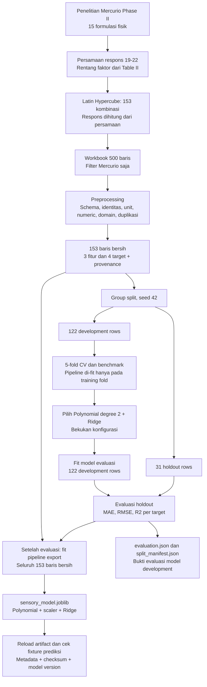
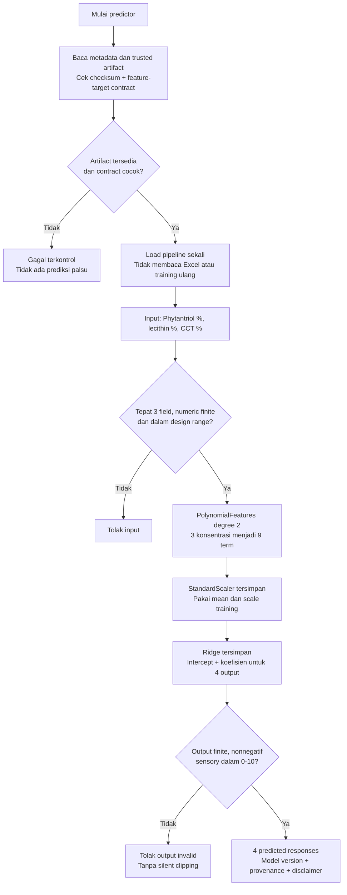
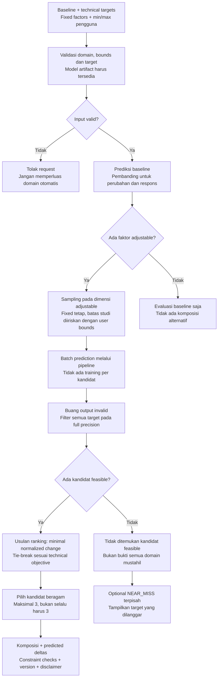
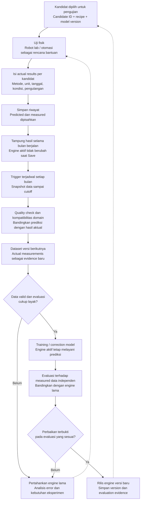

# AI Reformulation — sumber, processing, training, predict & optimizer

Dokumentasi checkpoint lokal, 17 September 2026. Panduan ini menghubungkan
hasil training yang sudah ada dengan desain engine berikutnya. Bukan klaim
bahwa optimizer baru, endpoint, penyimpanan hasil, atau robot lab sudah selesai.

## 1. Status aktual

| Bagian | Status |
|---|---|
| Preprocessing Mercurio | Selesai; 153 baris bersih |
| Benchmark empat model | Selesai; Polynomial + Ridge terpilih lewat development CV |
| Training/export pipeline | Selesai; full-data artifact dan fixture tersimpan |
| Prediksi satu komposisi lokal | Selesai; standalone SensoryPredictor |
| Optimizer lama | Ada source code; masih Random Forest dan punya masalah import/konstanta |
| Optimizer menggunakan Polynomial + Ridge | Belum diimplementasikan |
| AI Reformulation API/frontend nyata | Belum terhubung; UI masih prototype |
| Physical results/retraining/robot lab | Konsep pengembangan; retraining bulanan dipilih, belum diimplementasikan |

Formula Rescue adalah fitur terpisah: shampoo, XGBoost classifier, kandidat historis.
Jangan gunakan bobot ranking Formula Rescue sebagai aturan AI Reformulation tanpa kesepakatan.

## 2. Peta keseluruhan

```text
Penelitian fisik → persamaan publikasi → 153 baris generated
→ preprocessing → split/CV → training Polynomial + Ridge → artifact

Rencana saat aplikasi berjalan:
Baseline + technical target + batas bahan
→ optimizer mencari kombinasi → pipeline memprediksi respons
→ filter feasibility → ranking + diversity → Top 3
→ pengujian fisik per kandidat → hasil aktual
→ pengolahan data/evaluasi → retraining versi berikutnya
```

Training mengubah parameter model; predict hanya memakai parameter yang sudah disimpan.
Mengklik Run nantinya tidak boleh menjalankan training ulang.

### 2.1 Flowchart data dan training — sudah dijalankan



Tidak ada 153 eksperimen fisik baru pada tahap generasi. Holdout pernah dilihat
pada benchmark; evaluasi ini bukan konfirmasi independen baru. Panah evaluasi ke
full-data fit berarti urutan kerja, bukan tuning parameter memakai hasil holdout.

### 2.2 Flowchart predict — sudah bekerja lokal



Saat ini gagal terkontrol berarti exception Python di predictor standalone;
mapping ke HTTP 422/503/500 masih pekerjaan backend berikutnya. Output tetap
estimated, bukan hasil ukur. Predictor scalar belum menjadi batch optimizer.

### 2.3 Flowchart optimizer baru — desain, belum diimplementasikan



Flowchart ini menggambarkan usulan engine baru, bukan source optimizer lama.
Ranking lama masih hydration descending lalu stickiness ascending; source itu
belum memuat kontrol baseline/fixed/min-max. Predicted feasibility tidak sama
dengan laboratory feasibility. Jika recipe dibulatkan, prediksi dan constraint
harus diperiksa ulang untuk recipe rounded.

### 2.4 Flowchart hasil fisik dan peningkatan engine — rencana



Pengolahan hasil lab tidak otomatis mengubah model saat hasil diketik.
Frekuensi yang dipilih adalah satu kali per bulan, bukan online learning.
Loop update/retraining belum dibuat; bukan reinforcement learning secara otomatis.
Diagram ini khusus emulsion pilot. Hasil emulsion tidak menjadi label stability shampoo.

Flowchart memakai Mermaid. Buka Markdown Preview yang mendukung Mermaid;
jika VS Code hanya menampilkan kode, gunakan renderer Mermaid atau GitHub Markdown.
Diagram tidak menambahkan ketergantungan ke aplikasi frontend/backend.

## 3. Sumber penelitian dan persamaan

Mercurio, Calixto, dan Maia Campos (2020), Brazilian Journal of Pharmaceutical Sciences:
*Optimization of cosmetic formulations development using Box–Behnken design with response surface methodology: physical, sensory and moisturizing properties*.
Phase II: 15 formulasi; Table II memberikan rentang Phytantriol 0–3%,
soy lecithin 0–3%, CCT 0–5%. Persamaan 19–22 memberikan empat respons.
[Jurnal asli, Table II dan persamaan 19–22](https://www.scielo.br/j/bjps/a/MxDgqHGqq43Rn4VMDgcRqyw/?format=pdf&lang=en).

Dengan a, b, c sebagai faktor berkode:

```text
a = (Phytantriol_pct - 1.5) / 1.5
b = (Soy_lecithin_pct - 1.5) / 1.5
c = (CCT_pct - 2.5) / 2.5

consistency = 27320 + 1264.9*a + 2244.7*b
stickiness = 3 + 0.8125*b - 0.375*c + 0.6875*a² - 0.5625*b² - 0.65*a*b
oiliness = 2.66667 + 0.725*b + 0.74167*a² - 1.10833*b²
hydration = 1.5 + 0.09354*b
```

Transkripsi mengacu pada bentuk persamaan bernomor, bukan interpretasi setiap kalimat narasi.
Faktor berkode ini berbeda dari StandardScaler model ML; jangan menerapkan keduanya
secara manual sebelum memanggil pipeline.

## 4. Generasi dataset dan audit sumber

Workbook: [Phase2_500_Prototype_Training_Dataset.xlsx](Phase2_500_Prototype_Training_Dataset.xlsx).
Sheet Training_Master_500 memiliki 500 baris/44 kolom dari beberapa studi.
Blok MERCURIO_2020_P2 memiliki 153 baris, seluruhnya
MODEL_GENERATED_PUBLISHED_EQUATION dan is_empirical_ground_truth=False.

Metadata workbook menjelaskan Latin Hypercube dalam rentang desain, seed 20260917.
Alurnya: sampling konsentrasi → coding faktor → evaluasi empat persamaan → simpan respons.
Script generator asli tidak ditemukan; seed mengikuti metadata, bukan rekonstruksi script.
Audit read-only menghitung ulang respons seluruh 153 baris dan menemukan maksimum selisih:

| Respons | Maksimum selisih absolut workbook vs persamaan |
|---|---:|
| Hydration | 2.22e-16 |
| Stickiness | 8.88e-16 |
| Oiliness | 8.88e-16 |
| Consistency | 3.64e-12 |

Selisih tersebut pada tingkat presisi floating point. Kecocokan ini mengaudit
perhitungan generated target, bukan memvalidasi model terhadap lab.
153 baris tidak menambah jumlah eksperimen fisik independen sumber.
Tiga faktor bukan formula lengkap; base/water dan semua bahan lain tidak tersedia sebagai fitur.

## 5. Processing: dari workbook ke data model

Implementasi: [ml/preprocess_mercurio.py](ml/preprocess_mercurio.py).

| Langkah | Apa yang dilakukan | Alasan |
|---|---|---|
| Schema | Periksa kolom wajib | Jangan memproses format yang berubah diam-diam |
| Filter | Hanya study_id Mercurio | Jangan campur domain dan arti target antar studi |
| Identity/unit | Verifikasi tiga nama bahan dan unit % | Urutan faktor harus benar |
| Numeric | Konversi tujuh kolom model ke angka | Nilai tidak valid harus terdeteksi |
| Validity | Tolak missing, infinity/NaN, fitur di luar rentang | Bukan extrapolation tak terkontrol |
| Targets | Nonnegatif; stickiness/oiliness ≤10 | Cek konsistensi minimum output |
| IDs | Tolak row ID kosong/duplikat | Traceability |
| Duplicates | Hapus komposisi+respons identik; pertahankan respons berbeda | Hindari pengulangan persis tanpa menghapus variasi sah |
| Provenance | Simpan DOI/origin/validation role | Bedakan generated dan measured |

Hasil aktual: 153 diterima, 0 dibuang, 153 komposisi unik.
Tidak ada imputasi, clipping, noise injection atau scaling pada preprocessing awal.
Kolom proses/endpoint lain tidak diisi dengan nilai tebakan dan tidak dipakai sebagai fitur.

Input terurut:

```text
phytantriol_pct, soy_lecithin_pct, cct_pct
```

Target terurut:

```text
hydration_ratio, stickiness_score_0_10, oiliness_score_0_10, consistency_index
```

Hydration berupa ratio; sensory skor 0–10. Unit fisik consistency index belum
dikonfirmasi: jangan menamakannya viscosity cP. Provenance/ID bukan input model.
[EDA lengkap](data/processed/mercurio/MERCURIO_PREPROCESSING_EDA.md)
memuat statistik, missingness dan korelasi. Lecithin–hydration r=1 dalam generated sample.
Hubungan itu tidak membuktikan kausalitas baru.

## 6. Training: apa yang dipelajari model?

Implementasi: [ml/train_mercurio.py](ml/train_mercurio.py).
Model adalah supervised multi-output regression: konsentrasi masuk, empat angka keluar.
Tidak ada label stable/unstable, tidak ada LLM yang membaca clean insight.

### 6.1 Split dan evaluasi

GroupShuffleSplit 80/20, seed 42: 122 development, 31 holdout.
Komposisi sama harus berada dalam satu partisi. Pada data aktual semua komposisi unik.
Lima GroupKFold pada development menggunakan seed 42.
Semua transformation di-fit ulang pada training fold, bukan pada holdout.
Degree 2 dan alpha 1e-6 dibekukan setelah benchmark; tidak dituning lagi.
Holdout sudah dilihat pada benchmark: hasil training adalah reproduksi, bukan konfirmasi test baru.

### 6.2 PolynomialFeatures: tiga angka menjadi sembilan term

Untuk p=Phytantriol, l=lecithin, t=CCT, urutan term scikit-learn:

```text
[p, l, t, p², p*l, p*t, l², l*t, t²]
```

Contoh konsentrasi [1.5, 2.5, 3.0]:

```text
[1.5, 2.5, 3.0, 2.25, 3.75, 4.5, 6.25, 7.5, 9.0]
```

Term interaksi memungkinkan respons tergantung kombinasi bahan.
Term kuadrat memungkinkan bentuk melengkung. PolynomialFeatures tidak belajar
koefisien; ia hanya membuat representasi angka yang ditetapkan degree.

### 6.3 StandardScaler

Setiap term berubah menjadi z=(term-mean_training)/scale_training.
Mean/scale disimpan di pipeline. Prediksi baru memakai nilai tersimpan,
bukan menghitung ulang scaler dari satu kandidat atau semua kandidat optimizer.
Scaler bekerja pada sembilan term sesudah expansion, bukan pada target Y.

### 6.4 Ridge

Untuk tiap respons, Ridge mempelajari intercept dan sembilan koefisien:

```text
y_pred = intercept + Σ(coefficient_j * z_j)
objective = jumlah squared prediction errors + alpha * Σ(coefficient_j²)
alpha = 0.000001
```

Intercept tidak termasuk penalti default Ridge. Ada empat vektor koefisien,
satu untuk setiap output; pipeline tidak memberikan probabilitas/confidence interval.
Penalty lemah dipilih untuk approximation noise-free, bukan bukti robust terhadap data lab noisy.
Koefisien standardized polynomial tidak boleh dibaca sebagai efek kausal tunggal.

### 6.5 Evaluasi lalu full-data export

Model evaluasi dilatih pada 122 baris dan diuji pada 31 holdout.
Setelah itu pipeline baru dilatih pada seluruh 153 baris untuk artifact inference.
Model full-data tidak memiliki holdout yang masih untouched dalam dataset ini.
Tidak menghitung training predictions lalu menyebutnya generalization performance.

## 7. Metrik dan batas interpretasi

| Respons | Holdout MAE | Holdout RMSE | R² |
|---|---:|---:|---:|
| Hydration | 1.5078e-9 | 1.8118e-9 | ≈1 |
| Stickiness | 6.2993e-8 | 7.7041e-8 | ≈1 |
| Oiliness | 9.1261e-8 | 1.1080e-7 | ≈1 |
| Consistency | 4.7902e-5 | 5.5764e-5 | ≈1 |

MAE adalah mean absolute error dalam unit target; RMSE lebih sensitif pada error besar.
R² membandingkan error dengan variasi target. Bukan persentase accuracy.
MAPE/within-tolerance rate belum dihitung. Tidak ada accuracy klasifikasi.
Hasil hampir sempurna wajar karena keluarga polynomial dapat merepresentasikan
hubungan linear/kuadratik sumber; regularisasi menyebabkan selisih kecil.
Ini tidak membuktikan safety, efficacy, stability atau keberhasilan physical formulation.

[Laporan training dan CV lengkap](ml/artifacts/mercurio_polynomial_ridge_v1/AI_REFORMULATION_TRAINING_REPORT.md)
dan [evaluation.json](ml/artifacts/mercurio_polynomial_ridge_v1/evaluation.json)
tetap menjadi bukti numerik run. Audit persamaan sumber di bagian 4 melengkapi
keterangan sumber yang pada laporan run awal masih dicatat belum diverifikasi.
Manfaat ML dibanding persamaan langsung perlu dinilai; source equation bisa menjadi baseline.

## 8. Predict: satu komposisi menghasilkan apa?

Implementasi: [ml/predict_mercurio.py](ml/predict_mercurio.py).
Predictor memuat file joblib milik tim, memeriksa checksum/feature-target contract,
kemudian memakai pipeline yang sudah terlatih. Checksum bukan bukti keaslian;
joblib harus berasal dari sumber terpercaya karena dapat menjalankan kode.

```text
3 konsentrasi → validasi field/tipe/rentang → 9 polynomial terms
→ scaler tersimpan → Ridge tersimpan → validasi output → 4 predicted responses
```

Input harus tepat tiga field; boolean/string/null/NaN/infinity ditolak.
Output harus finite, nonnegatif, sensory ≤10. Tidak ada clipping diam-diam.
Pengecekan ini hanya validity minimum, bukan pemeriksaan semua kelayakan fisik.

Fixture nyata model full-data:

```json
{
  "input": {"phytantriol_pct": 1.5, "soy_lecithin_pct": 2.5, "cct_pct": 3.0},
  "predicted_responses": {
    "hydration_ratio": 1.5623600002295417,
    "stickiness_score_0_10": 3.2166667222342733,
    "oiliness_score_0_10": 2.6574122962540816,
    "consistency_index": 28816.466649685575
  }
}
```

Respons predictor juga menyertakan model_version, data_origin dan disclaimer.
Prediksi tidak berarti optimizer sudah memilih kandidat; composition tersebut adalah input contoh.

## 9. Optimizer: dari target ke komposisi

Forward model: komposisi → respons. Inverse search: target → cari komposisi melalui forward model.
Optimizer tidak otomatis merupakan model ML kedua; ia memakai predictor untuk menilai kandidat.

### 9.1 Perilaku source optimizer lama

[spontan_engine/inverse_optimizer.py](spontan_engine/inverse_optimizer.py):

1. Parse constraint target_min/target_max.
2. Latin Hypercube sampling, default 20.000 kombinasi, minimal 5.000.
3. Batch predict menggunakan Random Forest yang diimpor dari forward_model.
4. Filter semua target secara bersamaan, menggunakan angka full precision.
5. Urut hydration descending, tie-break stickiness ascending.
6. Greedy diversity: skip kandidat terlalu dekat, default Euclidean 0.25 percentage-point units.
7. Kalau tidak feasible, optional near-miss berdasarkan jumlah violation/std respons.
8. Format tabel/round angka untuk tampilan, bukan untuk menentukan kelolosan.

Status source belum siap: FACTOR_NAMES/TARGET_NAMES belum didefinisikan;
import bare module tidak cocok package; forward_model menjalankan training saat import;
dataset path lama tidak cocok. Belum ada baseline, fixed factors atau user min/max.
Near-miss normalization juga perlu perlindungan ketika std=0.
Komentar timing source bukan pengukuran untuk model polynomial baru.

### 9.2 Desain yang diusulkan untuk engine baru — belum diimplementasikan

1. Terima baseline, technical constraints, fixed/adjustable, user bounds.
   Insight diubah menjadi target terstruktur oleh pengguna/R&D; bukan NLP otomatis.
2. Irisan bounds pengguna dengan design range harus valid. Baseline juga dalam domain.
   Bahan fixed dipertahankan persis; hanya dimensi adjustable yang disampling.
   Jika seluruh bahan fixed, evaluasi satu baseline tanpa memakai qmc.scale rentang nol.
3. Prediksi baseline sekali; sampling kandidat dengan seed dan jumlah dibatasi server.
4. Prediksi batch melalui pipeline Polynomial+Scaler+Ridge; terapkan validity checks
   ke setiap kandidat. Predictor standalone saat ini hanya melayani satu komposisi,
   sehingga jalur batch perlu dibuat/test konsisten, bukan memanggil scalar wrapper tanpa evaluasi biaya.
5. Filter semua constraints; kandidat nonfinite atau output invalid tidak boleh masuk ranking.
6. Usulan ranking: feasible dahulu, lalu minimal perubahan normalized dari baseline,
   dengan tie-break performance sesuai target. Ini usulan produk, bukan ranking aktif.
7. Pilih maksimal tiga kandidat berbeda; jika hanya satu/dua feasible, tampilkan jumlah sebenarnya.
8. Empty dan near-miss dipisahkan. Near-miss tidak boleh disebut memenuhi target.
9. Return composition, baseline/candidate predictions, delta, constraint checks,
   model_version, provenance dan evidence boundaries. Jangan membuat confidence score palsu.

Contoh normalized change distance yang diusulkan:

```text
D = sqrt(((p-p0)/3)² + ((l-l0)/3)² + ((t-t0)/5)²)
```

Pembagi memakai lebar domain studi agar CCT tidak dominan hanya karena range lebih besar.
Ini ranking distance, bukan peluang berhasil. Bahan fixed memiliki delta nol.
Tidak ada skor cost/sustainability atau bobot Formula Rescue yang dipindahkan otomatis.

Sampling dapat melewatkan daerah feasible sempit; hasil empty berarti tidak ditemukan
dalam pencarian ini, bukan bukti matematis bahwa semua komposisi tidak feasible.
Sebelum pembulatan kandidat untuk lab, komposisi rounded perlu diprediksi/filter ulang;
prediksi komposisi asli tidak selalu berlaku persis untuk recipe rounded.

### 9.3 Contoh target dan batasnya

Contoh ilustrasi, bukan hasil optimizer yang sudah dijalankan:
hydration≥1.55, stickiness≤3.5, consistency di 28.000–33.000.
Fixture bagian 8 memenuhi target ilustrasi ini tetapi belum terbukti kandidat optimal/minimal-change.
Jika baseline sudah memenuhi target, UI perlu menyatakan baseline meets target;
jangan mengklaim improvement tanpa membandingkan predicted deltas.

Persamaan hydration dengan lecithin 0–3% memberi batas atas 1.59354.
Ini hasil perhitungan persamaan sumber: target hydration≥1.60 melampaui
response-surface sumber dalam domain, bukan sekadar maksimum sampled data ~1.5926.
Tidak boleh memperluas range atau menambah noise agar target terlihat berhasil.
Batas matematis tersebut bukan bukti bahwa hidrasi produk fisik tidak mungkin lebih tinggi.

## 10. Physical validation dan peningkatan engine — rencana

Setiap kandidat perlu candidate_id, composition tepat, baseline, model_version,
predictions, tanggal, metode/instrument/unit uji serta actual measured results.
Sensory measurement harus comparable dengan definisi target sumber.
Predicted vs measured disimpan terpisah; near-miss/failed experiments juga informatif.
Robot lab adalah opsi bantuan eksekusi; sekarang belum terintegrasi.

```text
Measured result → quality/compatibility check → evaluasi residual
→ dataset versi baru → train/compare → independent evaluation → engine versi baru
```

Jangan memakai prediction model sendiri sebagai ground truth tambahan.
Data generated tidak boleh mendominasi atau mencemari test measured tanpa desain evaluasi.
Jika measured terbatas, dapat diteliti correction/residual model atau strategi eksperimen;
belum ada bukti perbaikan aktual. Update biasa bukan reinforcement learning/online learning otomatis.
Training data tetap dipisahkan domain shampoo vs emulsion; hasil emulsion bukan label stability shampoo.

### 10.1 Kebijakan yang dipilih: retraining satu kali per bulan

Hasil pengujian dapat disimpan saat masuk, tetapi koefisien engine tidak langsung berubah.
Ada dua jalur terpisah:

```text
Jalur pemakaian setiap hari:
Engine V1 → kandidat → uji lab → Save hasil actual → riwayat/analisis error
                                                              ↓
Jalur peningkatan setiap bulan:
Snapshot data → validasi/kurasi → training kandidat V2 → evaluasi → rilis jika layak
```

Satu bulan adalah frekuensi untuk menjalankan pemeriksaan/update job,
bukan janji bahwa setiap bulan pasti ada model baru atau peningkatan performa.
Scheduler, storage hasil lab, job training dan pergantian artifact belum dibuat.
Ini keputusan workflow produk; bukan pemasangan jadwal aktif dalam aplikasi.

| Aktivitas | Kapan direncanakan | Mengubah engine aktif? |
|---|---|---|
| Save actual result | Saat pengguna mengisi hasil fisik | Tidak |
| Validasi format dan simpan measured record | Saat Save, jika backend sudah dibuat | Tidak |
| Predicted vs actual error | Bisa langsung dianalisis setelah Save | Tidak |
| Snapshot/quality gate/retraining job | Satu kali per bulan | Belum |
| Evaluasi kandidat model baru | Setelah training job | Belum |
| Aktivasi versi baru | Hanya jika kriteria evaluasi terpenuhi | Ya |

Usulan kalender: tanggal 1 setiap bulan, misalnya pukul 02.00 WIB,
mengambil data yang masuk sebelum cutoff awal bulan. Jam ini masih usulan,
belum dikonfigurasi. Catat timestamp UTC serta zona waktu jadwal Asia/Jakarta.
Hasil yang datang setelah cutoff diproses pada run berikutnya; aplikasi tidak perlu
menghentikan penerimaan hasil lab saat training berlangsung.

### 10.2 Apa yang terjadi saat pengguna menekan Save validation?

1. Terima candidate_id/experiment_id/batch_id, komposisi yang benar-benar dibuat,
   hasil actual, metode, satuan, tanggal dan kondisi. Prediksi/model_version
   saat kandidat dibuat tetap disimpan, tidak ditimpa output engine terbaru.
2. Parse numeric dengan aturan decimal yang jelas; cek finite, rentang dan kelengkapan.
   Nilai invalid ditolak/ditandai; actual kosong tidak diganti predicted.
3. Simpan sebagai measured record dengan status kualitas, revision dan provenance.
   Pengulangan harus punya replicate_id, bukan dihitung sebagai eksperimen independen baru.
4. Hitung residual untuk analisis, misalnya measured hydration - predicted hydration.
   Perhitungan residual tidak mengubah file sensory_model.joblib.

Contoh ilustrasi: V1 memprediksi hydration 1.56236, actual 1.48.
Residual=-0.08236. Setelah Save, V1 masih memprediksi menggunakan koefisien lama.
Selisih tersebut baru menjadi bahan evaluasi/training bulanan; bukan koreksi global
yang langsung diterapkan ke semua komposisi.

### 10.3 Langkah job bulanan: dari catatan ke dataset training

1. Buat snapshot immutable dengan dataset_version, cutoff, daftar experiment/revision,
   checksum dan jumlah row/batch. Data lama valid tetap dapat dipakai:
   jangan hanya memakai bulan terbaru dan melupakan bukti sebelumnya.
2. Join hasil dengan candidate recipe, actual composition, model version dan metadata uji.
   Gunakan komposisi aktual sebagai X; actual measured responses sebagai Y.
   Predicted columns hanya untuk evaluasi/residual, bukan target measured.
3. Periksa kompatibilitas metode/satuan/product system, domain tiga bahan,
   duplikasi/revisi, kondisi proses dan kualitas pengukuran.
   Jangan menggabungkan hydration ratio dengan angka instrumen mentah atau efek persentase.
4. Kelompokkan row yang terkait batch/eksperimen. Simpan replicate mentah;
   jika diringkas, dokumentasikan mean, variability dan jumlah pengulangan.
5. Tentukan pembagian training/validation/test sebelum fitting.
   Batch/pengulangan terkait tidak boleh tersebar ke training dan test.
   Test measured yang dipakai membandingkan model harus tidak dipakai melatih kandidat baru.

Contoh tabel siap pakai untuk satu respons:

| experiment_id | batch_id | phytantriol_pct | soy_lecithin_pct | cct_pct | measured_hydration | origin |
|---|---|---:|---:|---:|---:|---|
| EXP-001 | BATCH-001 | 1.5 | 2.5 | 3.0 | 1.48 | PHYSICAL_MEASUREMENT |

Angka actual pada contoh tabel adalah ilustrasi, bukan bukti lab kita.
Row dengan hanya hydration diukur tidak otomatis mempunyai target sensory lainnya.
Pipeline empat output saat ini memerlukan target lengkap; training per-response
atau kebijakan missing target harus dibuat terlebih dahulu untuk data parsial.

### 10.4 Quality gate: kapan job tidak melanjutkan training?

Jika tidak ada measured data baru yang valid, job dapat berstatus skipped.
Jika data tidak cukup untuk fit/evaluasi yang kredibel, job berstatus deferred;
engine aktif tetap dipakai dan alasan dicatat.
Tidak menetapkan angka minimum arbitrary sebagai jaminan: jumlah batch independen,
coverage konsentrasi, target completeness, noise dan protocol consistency perlu ditinjau.
Menambah banyak replicate satu komposisi tidak sama dengan menambah coverage formula.
Tidak memperluas domain atau menganggap generated rows sebagai pengganti test measured.

### 10.5 Training kandidat versi berikutnya

Jika data layak, latih model kandidat pada snapshot training:
pilihan yang dapat diteliti adalah refit dari measured data atau residual/correction model.
Generated dan measured harus ditandai; strategi campuran/bobot belum diputuskan.
Jangan default menggabungkan keduanya sebagai evidence setara.

```text
Model correction, jika dipilih:
residual training target = measured - baseline model prediction
corrected prediction = baseline prediction + predicted residual
```

Ini opsi desain, bukan algoritma update yang sudah tersedia.
Perbedaan actual bisa disebabkan proses/metode yang tidak menjadi fitur model;
training ulang dari tiga konsentrasi saja belum tentu menyelesaikan penyebabnya.
Initial V1 tetap Polynomial + Ridge; job bulanan tidak wajib selalu mengubah keluarga model.
Versi kandidat naik hanya ketika artifact benar-benar dibuat; bulan tanpa rilis tetap V1.

### 10.6 Evaluasi, aktivasi dan rollback

Bandingkan engine aktif dan kandidat pada measured test yang sama:
MAE/RMSE/R² per respons, valid domain/output, serta konsistensi recipe/constraint optimizer.
Tetapkan kriteria penerimaan dan toleransi regresi sebelum melihat hasil kandidat.
Belum ada threshold numerik penerimaan yang disepakati; jangan mengklaim gate ilmiah selesai.
Penurunan error satu target tidak otomatis membenarkan kerusakan besar target lain.

Test yang terus dipakai memilih rilis lama-lama menjadi validation set,
bukan independent confirmation selamanya. Sisihkan batch measured baru untuk
audit prospektif, dan dokumentasikan perubahan evaluation set antar bulan.

Jika kandidat belum memenuhi kriteria, jangan aktifkan; simpan hasil evaluasi dan gunakan engine lama.
Jika layak, simpan pipeline, metadata, checksum, dataset version dan evaluation,
lakukan load/fixture/integration checks, lalu aktifkan versi baru secara terkontrol.
Mekanisme pergantian harus mencegah prediction memakai scaler/model campuran versi.
Engine aktif tetap melayani request selama training; file aktif tidak ditimpa saat masih dipakai.
Simpan artifact sebelumnya untuk rollback jika loading, output atau layanan bermasalah.
Riwayat kandidat lama tetap menunjuk model_version lama.

### 10.7 Contoh kalender dan tanggung jawab runtime

| Periode ilustrasi | Aktivitas | Engine pengguna |
|---|---|---|
| September | Gunakan V1 dan kumpulkan hasil lab | V1 |
| Awal Oktober | Snapshot, quality gate, train kandidat, evaluasi | V1 |
| Setelah evaluasi Oktober | Jika layak rilis V2; jika tidak tetap V1 | V2 atau V1 |
| Awal November | Ulangi dengan snapshot berikutnya | Versi terakhir yang lolos |

Training job berjalan terpisah dari request API. Jangan menjalankannya di POST predict/optimize.
Tempat eksekusi/akses scheduler masih perlu dipilih; untuk aturan hackathon,
training yang diwajibkan organizer harus terjadi di Cloudeka dengan bukti yang sesuai.
Notebook yang dimatikan tidak otomatis menjalankan training bulanan.
Deploy frontend di Vercel tidak dengan sendirinya mengaktifkan jadwal training.
Penetapan bulan di dokumen ini belum memasang cron, database atau service baru.

## 11. Reproduksi dan checkpoint

Dari terminal PowerShell root proyek D:\Spontan-Team:

```powershell
py ml/predict_mercurio.py
```

Hasil: empat predicted responses sesuai fixture; tidak membuka Excel atau training ulang.
Training/pipeline sebelumnya diverifikasi dengan 13 unit test dan reload artifact.
Tahap dokumentasi ini tidak menjalankan retraining, mengganti model, push atau deploy.
Verifikasi isolated runtime/production Vercel belum dilakukan.

Untuk reproduksi training yang disengaja saja:

```powershell
py ml/train_mercurio.py --output ml/artifacts/mercurio_polynomial_ridge_v2
```

Output baru menjaga v1 tidak tertimpa. Cloudeka/Linux memakai python;
deklarasi --environment cloudeka bukan bukti otomatis bahwa run terjadi di Cloudeka.

Langkah implementasi berikutnya: adapter optimizer untuk artifact baru dan test satu skenario,
baru endpoint dan frontend. Jangan menganggap dokumentasi desain sebagai fitur yang sudah berjalan.

Predicted / estimated and requires physical laboratory validation.
