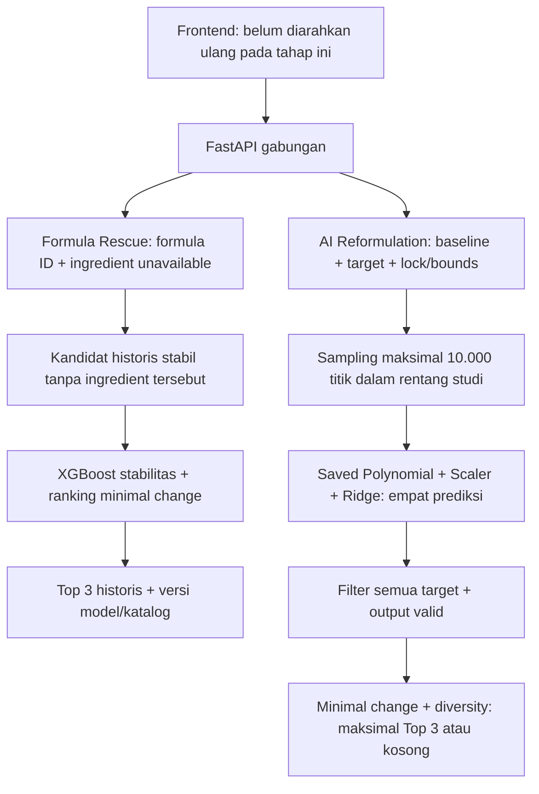

# Backend Integration — Formula Rescue + AI Reformulation

Tanggal verifikasi: 17 September 2026. Scope: satu backend **lokal**, dua saved
model dan bounded optimizer. Tidak melatih ulang artifact, mengubah frontend,
push, deploy atau membuat endpoint publik.

## Apa yang sekarang bekerja

Kedua model tidak digabung menjadi satu model ML: **API-nya** yang digabung.
Formula Rescue khusus shampoo; AI Reformulation khusus tiga faktor emulsi
Mercurio. Prediksi stabilitas shampoo tidak diterapkan ke kandidat emulsi.

## File utama

| File | Fungsi |
|---|---|
| `backend/main.py` | Routing, health/readiness, CORS, body cap dan safe errors |
| `backend/schemas.py` | Strict request types/ranges, target dan bounds |
| `backend/predictor.py` | Trusted cached model loading + real fixture inference |
| `backend/reformulation.py` | Seeded LHS, batch prediction, feasibility/ranking/diversity |
| `backend/tests/test_api.py` | Real-model integration dan fault-injection tests |
| `backend/tests/http_smoke.py` | Enam endpoint melalui HTTP nyata di loopback |
| `backend/requirements*.txt` | Observed direct serving/development dependency pins |
| `backend/README.md` | Cara menjalankan dan fixture Swagger untuk pemula |
| `docs/API_CONTRACT.md`, `docs/MODEL_CONTRACT.md` | Implemented contract; template masa depan tetap disimpan |

`ml/predict_mercurio.py` hanya diubah untuk mendukung import package dan CLI;
pipeline/weights/artifact tidak diganti. Rescue menggunakan modul existing di
`Hackathon/`; pemindahan/duplikasi engine dihindari.

## Hasil verifikasi aktual

| Pemeriksaan | Hasil |
|---|---|
| Backend unit/API tests | 20/20 lulus |
| Mercurio ML regression tests | 13/13 lulus |
| Existing Hackathon tests | 25/25 lulus |
| HTTP nyata | `/health`, `/ready`, `/formulas`, `/reformulate`, AI `/predict`, AI `/optimize`: semua 200 |
| Formula Rescue fixture | Formula 7, Plantacare 818 → 288, 292, 190 |
| AI fixture | Hydration 1.56236000023; sticky 3.21666672223; oiliness 2.65741229625; consistency 28816.46664969 |
| AI search fixture, two targets | 10.000 sampled; 1.297 feasible; tiga returned |
| Fixed/custom/equal bounds | Kandidat tetap memenuhi locks/ranges |
| All-fixed / hydration target 1.6 | HTTP 200, daftar kosong tanpa fake fallback |
| Determinism dan batch/scalar | Seed sama menghasilkan respons sama; prediksi kandidat cocok dengan scalar pipeline |
| Invalid/nonfinite/extra fields | Controlled 422, tidak gagal saat serialisasi NaN |
| Missing model | Controlled 503; liveness tetap 200 dan engine lain independen |
| Unexpected model failure | Generic 500; tidak membocorkan path/traceback; CORS tetap tersedia |
| Invalid response schema | Generic 500 tanpa bocoran output; schema terlihat di Swagger |
| Capacity / body / content type | 429 / 413 / 415 sesuai kontrak |
| CORS | Preflight origin lokal lolos; origin tidak terdaftar ditolak |

Smoke test menghentikan child server pada akhir pemeriksaan; tidak ada server
publik/tunnel baru. Test suite ML memakai fit kecil pada fixture untuk menguji
fungsi; bukan retraining atau penggantian artifact produksi.

## Cara kerja optimizer dan batas ilmiah

Polynomial + Ridge hanya memprediksi empat respons. **Optimizer terpisah**
mencari komposisi di domain 0–3%, 0–3%, 0–5%, menerapkan target dan memilih
perubahan terkecil. Ranking jarak Euclidean dihitung setelah setiap faktor
dibagi lebar domain studi `[3, 3, 5]`; jadi skala faktor sebanding.
Hydration descending dan sticky ascending hanya tie-breaker. Kandidat berbeda
dari baseline dan beragam minimal 0.03 pada jarak ternormalisasi secara default.

Target dicek sebelum pembulatan. Jika resep dibulatkan untuk dibuat di lab,
resep aktual harus diprediksi/dicek ulang; tabel bulat bisa mengubah feasibility.
Tidak ada jaminan global optimum dan empty search tidak membuktikan tidak ada
solusi. Jika baseline sudah lolos, respons menampilkan baseline checks; kandidat
tetap hanya alternatif yang berbeda, tidak mengklaim baseline wajib diganti.

Data sensory berasal dari persamaan publik (`MODEL_GENERATED_PUBLISHED_EQUATION`),
bukan pengukuran baru. Near-perfect R² mereproduksi persamaan, bukan akurasi
lab. Candidate `PREDICTED_FEASIBLE` hanya berarti lolos target **prediksi**.
Tidak memprediksi keamanan, stabilitas emulsi, biaya atau sustainability.

## Mitigasi dan yang belum diverifikasi

- Trusted joblib tidak menerima path/file upload; checksum/kontrak/fixture dicek.
  Checksum bukan autentikasi jika metadata ikut diubah.
- Cache per proses + lock mencegah double-load awal; gagal load tidak diklaim ready.
- Strict finite/range validation dan cap body/sampling mengurangi input abuse.
- Dua slot optimizer per proses bukan distributed/per-user rate limiting.
- Tidak ada auth/backend session storage. Demo login frontend bukan keamanan API.
- Direct dependency pins sesuai runtime lokal; **belum** fresh-venv install,
  transitive lock/advisory audit, Linux CPU bundle, cold-start/load test atau
  Vercel runtime/artifact inclusion review. Tidak diklaim production-secure.
- CORS default hanya untuk lokal. Public origins/HTTPS/access/rate limits perlu
  keputusan terpisah sebelum expose. Tidak ada request timeout middleware.
- Repo `D:\Spontan-Team` belum memiliki `.git` pada pemeriksaan ini. Tidak dilakukan
  git init, push, atau perubahan repository Git secara diam-diam.

## Checkpoint berikutnya, belum dikerjakan

1. Pengguna menjalankan backend dan memverifikasi `/ready` / fixtures di `/docs`.
2. Setelah disetujui: arahkan Formula Rescue proxy ke unified backend dan hubungkan
   AI wizard ke request/response contract; target teks perlu mapping yang eksplisit.
3. Sesudah end-to-end lokal lolos: review deployment terpisah. Monthly lab-data
   improvement tetap desain di laporan engine, belum scheduler atau database.

> Predicted / estimated and requires physical laboratory validation.
