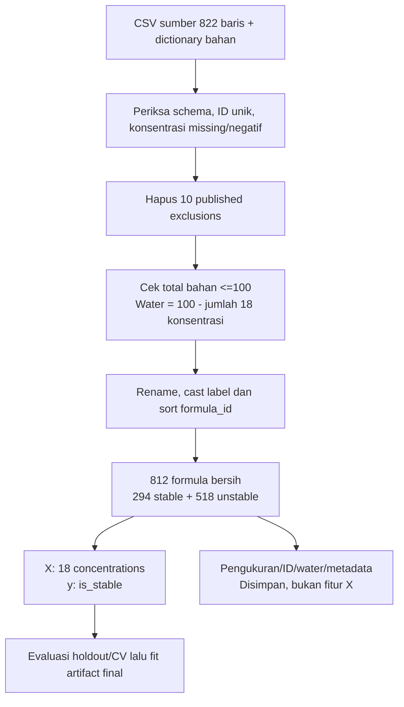
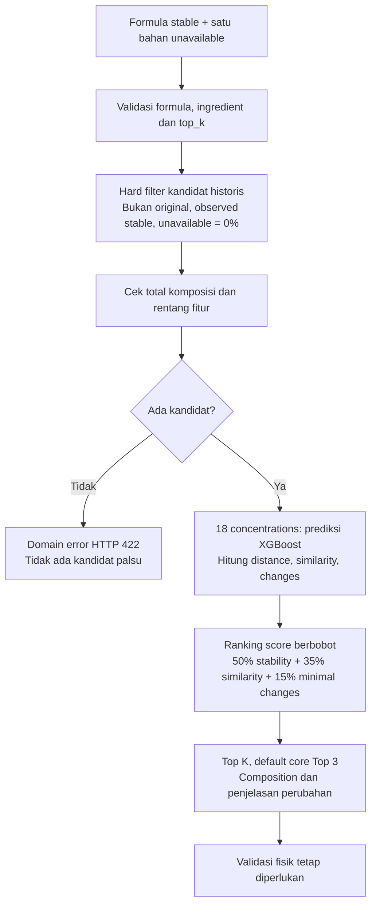
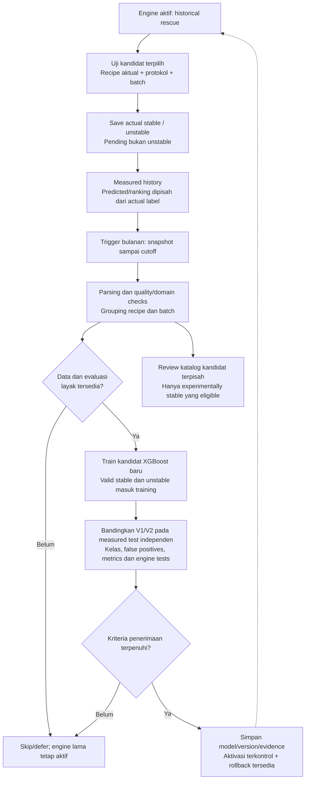

# Formula Rescue — Preprocessing, Training, dan Accuracy Model Lama

Tanggal dokumentasi: 17 September 2026.
Keputusan: tetap memakai baseline XGBoost existing. Tidak mengganti model dengan
hasil benchmark improvement. Dokumen ini menjelaskan artifact lama, bukan training baru.

## 1. Ringkasan hasil

**Accuracy holdout model lama: 80,98% (132 prediksi benar dari 163 formula test).**
ROC-AUC holdout: **0,8413**; mean ROC-AUC 5-fold cross-validation: **0,8311**.

Accuracy ini menilai label phase stability pada dataset sumber, bukan peluang
Top 3 rescue berhasil di lab. Model final deployment dilatih pada seluruh
812 formula setelah evaluasi; tidak ada independent test baru untuk artifact final.

> Predicted / estimated and requires physical laboratory validation.

## 2. Gambaran alur

```text
CSV mentah: 822 formula + dictionary bahan
   ↓
Validasi dan hapus 10 formula exclusion publikasi
   ↓
812 formula bersih + konsentrasi 18 bahan + label stability
   ↓
Holdout 80/20 dan evaluasi 5-fold terpisah
   ↓
XGBoost belajar composition → stability
   ↓
Catat metrik pada data yang tidak dilihat model evaluasi
   ↓
Fit model final pada seluruh 812 formula
   ↓
Simpan model + metadata + metrics
   ↓
Rescue engine memakai stability estimate sebagai salah satu sinyal ranking
```

## 3. Sumber dan bentuk data

Berdasarkan attribution repository Formula Rescue, sumbernya adalah
sustainable-processes/formulations_ML-DoE dan paper Chitre et al. (2024),
Accelerating Formulation Design via Machine Learning: Generating a High-throughput
Shampoo Formulations Dataset. Referensi tersimpan pada [data README](Hackathon/data/README.md).

Input preprocessing:

- Hackathon/data/raw/PhDFormulationsDataset_2023.csv.
- Hackathon/data/raw/SpeciesDictionary.csv: nama, jenis, dan informasi bahan.

Satu baris = satu formula beserta hasil pengukuran eksperimen sumber.
Dataset ini **bukan** dataset 500-record literature-derived untuk AI Reformulation.

| Tahap | Formula |
|---|---:|
| Data mentah | 822 |
| Dihapus sesuai published exclusions | 10 |
| Data bersih | 812 |
| Label stable | 294 |
| Label unstable | 518 |

Target is_stable berasal dari Stability_Test: 1 = experimentally labelled stable,
0 = unstable. Definisi stability mengikuti protokol sumber, bukan safety approval.

## 4. Tahap preprocessing

Implementasi: [preprocess_dataset.py](Hackathon/scripts/preprocess_dataset.py).

### 4.1 Membaca dan memeriksa struktur

Script membaca dua CSV, memastikan kolom pengukuran wajib dan semua kolom bahan
dari dictionary tersedia. Bahan non-solvent menjadi concentration features.
Water diproses sebagai solvent/komponen penyeimbang.

### 4.2 Memvalidasi input

- ID formula wajib unik.
- Konsentrasi bahan tidak boleh missing atau negatif.
- Semua ID pada published exclusion list harus ditemukan.
- Total konsentrasi non-water pada baris yang dipertahankan tidak boleh melebihi 100%.

Input bermasalah ditolak, bukan diisi nilai tebakan.
Validasi feature values dan binary labels dilakukan lagi saat load training data.

### 4.3 Menghapus exclusion list

| Formula ID | Alasan yang tercatat di kode |
|---|---|
| 26, 209 | Missing rheology data |
| 568, 579, 619, 623, 624, 661 | Turbidity > 4000 NTU |
| 750, 787 | Failed pH adjustment |

Tidak ada row lain yang dihapus atau diimputasi oleh script preprocessing.
Daftar ini mengikuti publication exclusions, bukan pemilihan row agar accuracy naik.
Metrik kemudian berlaku untuk populasi data yang sudah memenuhi cleaning ini,
bukan otomatis seluruh formula ekstrem/rejected pada sumber.

### 4.4 Merapikan nama kolom

Contoh:

| Nama awal | Nama bersih |
|---|---|
| ID | formula_id |
| Stability_Test | is_stable |
| Plantacare 818 | plantacare_818_pct |
| Turbidity_NTU | turbidity_ntu |
| Viscosity | viscosity_category |

Nama bahan dibuat lowercase, karakter non-alphanumeric diganti underscore,
lalu diberi suffix _pct. Label stability dikonversi ke integer int8.

### 4.5 Menghitung water

```text
water_pct = 100 − jumlah konsentrasi 18 bahan
```

Water dibulatkan enam angka desimal. Pada summary existing, water berada antara
66,68% dan 84,06%. Water disimpan untuk tampilan komposisi, bukan input model.

### 4.6 Mengurutkan dan menyimpan data

Data diurutkan berdasarkan formula_id; index direset.

| Output | Isi |
|---|---|
| formulations_clean.csv | Formula bersih, concentrations, water, target, dan pengukuran |
| ingredient_metadata.csv | Mapping feature, display name, ingredient type, informasi dictionary |
| dataset_summary.json | Jumlah rows, exclusion IDs, ordered features, target |

Tidak ada scaling/normalization, imputation, SMOTE, augmentation, atau generated
synthetic rows pada pipeline model lama. Tree-based input memakai concentration
values apa adanya; bukan teks ingredient atau product reviews.

### 4.7 Perbedaan preprocessing sumber dan processing hasil lab baru

Pipeline existing khusus CSV publikasi: keberadaan sepuluh exclusion IDs memang
diwajibkan oleh script. Karena itu, file hasil lab baru tidak boleh langsung
dikirim ke script sumber tersebut. Dibutuhkan adapter measured-results terpisah
yang memakai contract 18 bahan yang sama, tanpa mewajibkan exclusion IDs sumber.
Adapter ini masih desain, belum dibuat.



Data baru perlu menyimpan: candidate_formula_id, experiment_id, batch_id,
replicate_id, komposisi yang benar-benar dibuat, model/catalog version,
tanggal/kondisi/protokol pengujian dan actual stability outcome.
Unstable adalah hasil yang sah, bukan kesalahan format atau row yang otomatis dibuang.
Unknown/pending berbeda dari unstable; jangan mengubah hasil kosong menjadi label 0.
Tidak semua failed experiment berarti unstable: kegagalan instrumen/pembuatan
harus dibedakan dari hasil uji phase stability yang valid.

Aturan parsing yang direncanakan:

| Input hasil baru | Processing yang diperlukan |
|---|---|
| Nama bahan | Map melalui dictionary ke tepat 18 feature names |
| Konsentrasi | Parse angka/satuan %, tolak NaN/infinity/negatif dan total >100 |
| Bahan tidak dicantumkan | Hanya dianggap 0 jika komposisi lengkap secara eksplisit mengonfirmasi bahan tidak ada |
| Ingredient baru di luar dictionary | Tandai out-of-contract; jangan diabaikan atau dipetakan sembarang |
| Konsentrasi aktual berbeda dari recipe | Gunakan komposisi aktual sebagai X, bukan recipe usulan |
| Water | Verifikasi mass balance; hitung derived water hanya jika tidak ada komponen lain yang belum dimodelkan |
| Outcome stable/unstable | Map menjadi 1/0 hanya jika protokol dan assessment rule cocok |
| Pending/invalid test | Tidak menjadi training label sampai ada hasil sah |
| Prediction/ranking score | Simpan untuk audit; bukan actual label |
| Replicate/revisi | Simpan identitas/version; hindari duplicate ingestion dan test leakage |

Finite checks/aturan protokol untuk data baru di atas adalah kebutuhan adapter baru,
bukan klaim bahwa semua pengecekan telah ada pada script preprocessing sumber.
Label stability tidak dapat diturunkan otomatis dari satu angka turbidity atau
viscosity tanpa aturan protokol yang valid. Sumber dan hasil internal tetap diberi provenance berbeda.

Contoh record ringkas, hanya ilustrasi (bukan uji ulang yang sudah terjadi):

```json
{
  "experiment_id": "EXP-RESCUE-001",
  "batch_id": "BATCH-RESCUE-001",
  "candidate_formula_id": 288,
  "model_version": "stability_v1_example",
  "catalog_version": "catalog_v1_example",
  "data_origin": "INTERNAL_PHYSICAL_MEASUREMENT",
  "protocol_id": "REQUIRED_VALIDATED_PROTOCOL",
  "actual_is_stable": 0,
  "record_status": "VALID_MEASURED"
}
```

Record lengkap wajib juga memuat 18 concentrations aktual, tanggal, assessment,
kondisi dan traceability. model/catalog version pada contoh adalah label ilustrasi,
bukan field/version yang sudah dikirim oleh API saat ini.
Untuk training, actual composition menjadi X dan actual_is_stable menjadi y;
ID/protokol/provenance disimpan untuk audit, grouping dan eligibility, bukan predictor input.
Hasil internal berbeda dari source measurement tidak menghapus label historis sumber:
periksa variasi batch/proses/protokol dan simpan keduanya dengan asal yang jelas.

## 5. Input dan target model

Input X: konsentrasi 18 bahan dalam urutan persis metadata.

```text
 1. texapon_sb_3_kc_pct
 2. plantapon_acg_50_pct
 3. plantapon_lc_7_pct
 4. plantacare_818_pct
 5. plantacare_2000_pct
 6. dehyton_mc_pct
 7. dehyton_pk_45_pct
 8. dehyton_ml_pct
 9. dehyton_ab_30_pct
10. plantapon_amino_scg_l_pct
11. plantapon_amino_kg_l_pct
12. dehyquart_a_ca_pct
13. luviquat_excellence_pct
14. dehyquart_cc6_pct
15. dehyquart_cc7_benz_pct
16. salcare_super_7_pct
17. arlypon_f_pct
18. arlypon_tt_pct
```

Target y: is_stable. Prediction output: estimated P(stable).

| Kolom tidak digunakan sebagai X | Alasan |
|---|---|
| formula_id | Identifier, bukan property formula |
| water_pct | Derived dari concentrations lainnya |
| is_stable | Target yang diprediksi; bukan input |
| Turbidity/error, viscosity category, rheology type | Pengukuran lanjutan tidak digunakan untuk prediksi berbasis komposisi; potensi leakage/ketergantungan pada hasil eksperimen |

Memiliki concentration = 0 berarti bahan tidak ada dalam formula, bukan missing value.
Urutan fitur wajib sama saat training dan inference. Tidak menambahkan bahan baru
di luar contract hanya karena namanya dimasukkan dari frontend.

## 6. Pembagian data sebelum training evaluasi

Implementasi: [train_stability.py](Hackathon/ml/train_stability.py).

### Holdout 80/20

Holdout adalah sebagian data yang tidak digunakan untuk melatih model evaluasi.

| Bagian | Rows |
|---|---:|
| Training | 649 |
| Testing | 163 |
| Test stable | 59 |
| Test unstable | 104 |

Split menggunakan stratify=target, random_state=42, test_size=0.2.
Stratified berarti proporsi kelas dijaga. Seed membantu reproduksi.
Karena preprocessing ini tidak fit statistik/transformasi dari data, tidak ada
scaler/imputer full-data yang ikut membawa informasi test ke training.

### Cross-validation

Secara terpisah, StratifiedKFold membagi seluruh 812 rows menjadi lima folds,
shuffle=True dan random_state=42. Setiap fold diuji oleh model yang tidak
dilatih pada rows test fold itu.

CV menggunakan seluruh dataset termasuk rows holdout dalam evaluasi yang terpisah;
jadi CV bukan external confirmation terhadap holdout. Model memakai parameter tetap,
bukan hasil tuning ke test set pada baseline script.

## 7. Model dan konfigurasi training

XGBoost classifier menggabungkan decision trees untuk mengenali pola nonlinear
konsentrasi bahan dan label stability. Model ini tidak mengetahui chemistry secara
universal dan tidak menghasilkan formula secara langsung.

| Parameter | Nilai |
|---|---:|
| objective | binary:logistic |
| tree_method | hist |
| n_estimators | 300 |
| max_depth | 3 |
| learning_rate | 0.03 |
| min_child_weight | 2 |
| subsample | 0.85 |
| colsample_bytree | 0.85 |
| reg_alpha | 0.05 |
| reg_lambda | 1.5 |
| random_state | 42 |
| eval_metric | logloss |

Ini fixed baseline; tidak ada hyperparameter search, early stopping, atau
probability calibration khusus pada model lama.

Metadata existing mencatat training CPU; bukan bukti training GPU/Cloudeka.
Library versions artifact: Python 3.12.7, pandas 3.0.2, sklearn 1.8.0, XGBoost 3.4.1.
Training timestamp UTC: 2026-09-14T13:36:45.065831+00:00.

## 8. Prediksi dan threshold

```text
18 concentrations → predict_proba → stable probability estimate
```

Saat menghitung class metrics:

- score >= 0.5 → predicted stable;
- score < 0.5 → predicted unstable.

Threshold tersebut hanya keputusan klasifikasi untuk laporan.
Aplikasi rescue memakai skor kontinu untuk ranking; tidak menganggap 0.5 atau
skor tinggi sebagai jaminan lab success. Probability estimate belum dikalibrasi
khusus menjadi probabilitas keberhasilan lab.

## 9. Hasil holdout akhir

Sumber angka: [metrics.json model lama](Hackathon/ml/artifacts/metrics.json).

| Metric | Hasil |
|---|---:|
| Accuracy | **80,98%** |
| Balanced accuracy | 78,13% |
| Precision stable | 76,92% |
| Recall stable | 67,80% |
| F1 stable | 0,7207 |
| ROC-AUC | **0,8413** |
| Average precision | 0,7702 |
| Log loss | 0,4705 |

### Confusion matrix

| Aktual / Prediksi | Unstable | Stable |
|---|---:|---:|
| Aktual unstable | 92 | 12 |
| Aktual stable | 19 | 40 |

- True negative 92: unstable yang dikenali benar.
- False positive 12: unstable salah disebut stable.
- False negative 19: stable yang terlewat.
- True positive 40: stable yang dikenali benar.

```text
Accuracy = (92 + 40) / 163
         = 132 / 163
         = 0.80981595 ≈ 80,98%
```

Precision stable = 40/(40+12) = 76,92%.
Recall stable = 40/(40+19) = 67,80%.
Model yang selalu menjawab unstable mendapat accuracy 104/163 = 63,80%;
accuracy perlu dibaca bersama imbalance kelas dan kesalahan false positives.

ROC-AUC bukan “84,13% formula akan berhasil”. Itu ukuran kemampuan memisahkan
skor kelas stable dan unstable. Log loss lebih rendah lebih baik untuk probabilistic
prediction, bukan bukti probability calibration sempurna.

## 10. Hasil cross-validation model lama

| Metric | Mean | Std antar-fold |
|---|---:|---:|
| ROC-AUC | 0,8311 | 0,0343 |
| Average precision | 0,7440 | 0,0712 |
| F1 | 0,6720 | 0,0608 |
| Balanced accuracy | 0,7462 | 0,0438 |

ROC-AUC per fold: 0.8255, 0.8642, 0.7672, 0.8529, 0.8456.
Std adalah variasi antarfold, bukan confidence interval.
Accuracy mean CV **tidak dicatat** dalam artifact metrik lama; jangan mengada-adakannya
atau mencampurnya dengan angka benchmark improvement.

## 11. Final model dan handover artifact

Setelah evaluasi, script membuat model baru dengan konfigurasi sama dan fit
menggunakan **seluruh 812 formula** untuk penggunaan aplikasi.

| Artifact | Fungsi |
|---|---|
| stability_model.json | Native XGBoost JSON model final |
| model_metadata.json | Ordered features, versions, parameters, data hash, timestamp |
| metrics.json | Holdout/CV evidence dari model evaluasi |

80,98% tetap **holdout result model evaluasi**, bukan test independen atas final
model yang sudah dilatih full-data. Jangan menilai final model dengan training
rows lalu menyebut hasilnya unseen accuracy.

SHA-256 dataset yang tercatat:
43377a174fd4414c7f25d1a9105ffc7cb78fc509dfb784cb0f5b0411941cacc3.

Inspect sebelumnya memastikan hash CSV current cocok dengan metadata, 18 input
features tidak missing, dan tidak ada duplicate exact 18-feature compositions.
Itu tidak membuktikan semua formula independen atau bebas kemiripan antar-split.

## 12. Peran model dalam sistem Formula Rescue

```text
Formula awal + ingredient unavailable
   ↓
Hard filter: berbeda dari original, observed stable, ingredient unavailable = 0%
   ↓
Model estimate + composition similarity + minimal changes
   ↓
Rank Top 3 dan kandidat berikutnya
```

Bobot existing: stability 50%, similarity 35%, minimal changes 15%.
Rescue score adalah ranking score, bukan probability of success.
Water excluded dari input model dan composition distance.

Kandidat historis termasuk dataset full-data model final. Skor pada kandidat
bukan bukti generalisasi unseen. Model tidak memilih substitusi bahan secara bebas,
tidak memprediksi sensory, dan tidak memberi safety/efficacy approval.

### 12.1 Processing saat request: detail perhitungan engine

Implementasi: [RescueEngine.reformulate](Hackathon/rescue/engine.py).
Original harus experimentally stable; ingredient unavailable harus dikenal dan
benar-benar ada di original. top_k dibatasi 1–10, bukan jumlah tanpa batas.
Hard filter memilih kandidat yang berbeda, observed stable, serta bahan unavailable
0% dengan epsilon 1e-9. Total bahan+water harus 100% dalam toleransi 1e-6;
konsentrasi berada dalam rentang fitur dataset yang dimuat engine.

Untuk concentration vectors original x0 dan kandidat x, tanpa water:

```text
distance = sum(abs(x_i - x0_i)), untuk 18 fitur
similarity = clip(1 - distance/100, 0, 1)
number_of_changes = jumlah fitur dengan absolute delta >=0.01 percentage point
minimal_changes = 1 - number_of_changes/18
predicted_stability = XGBoost.predict_proba(candidate)[stable_class]
rescue_score = 0.50*predicted_stability + 0.35*similarity + 0.15*minimal_changes
```

0.01 adalah threshold perubahan konsentrasi, bukan cutoff stability.
Score diurut descending, tie-break predicted stability descending, similarity
descending, lalu formula_id ascending. Kandidat tidak diubah recipe-nya oleh engine.
Hasil menyertakan rank, formula_id, ingredients, changed ingredients, component
scores dan constraint checks. current API belum menyediakan model/catalog version
sebagai provenance lengkap per hasil; versi perlu ditambahkan sebelum feedback operasional.



Engine memuat artifact/dataset untuk digunakan ulang, bukan training per request.
Meskipun semua kandidat sudah observed stable pada sumber, skor model dapat berbeda.
Itu membantu ranking saat ini, tetapi inference pada historical training rows
bukan ukuran unseen performance dan bukan pembuktian Top 3 lebih berhasil.

## 13. Batas dan alasan mempertahankan model lama

- Generalisasi yang diuji: formula dari ruang bahan/protokol sumber yang sama.
- Random split dapat mencampur formula mirip; bukan evaluasi batch eksternal.
- Tidak membuktikan stability jangka panjang, ingredient baru, process baru,
  regulatory readiness, atau domain emulsion sensory.
- 12 false positives pada holdout menunjukkan physical validation tetap wajib.
- Benchmark improvement terpisah tidak memberikan peningkatan XGBoost yang kuat;
  karena itu model lama dipertahankan sesuai keputusan pengguna.
- Angka benchmark tidak menggantikan artifact metrics lama atau holdout 80,98%.

Lihat [hasil benchmark terpisah](FORMULA_RESCUE_MODEL_IMPROVEMENT.md).
Dokumen ini tidak menghapus hasil eksperimen tersebut atau mempromosikan model baru.

## 14. Cara verifikasi tanpa retraining

Di terminal PowerShell, dari folder Formula Rescue:

```powershell
cd D:\Spontan-Team\Hackathon
py -m unittest discover -s tests -v
Get-Content ml\artifacts\metrics.json
Get-Content ml\artifacts\model_metadata.json
```

Tests memeriksa data/contract/artifact/engine/API, bukan menghitung ulang seluruh
holdout metrics. Expected suite current: 25 tests, termasuk tests benchmark.
Angka evaluasi dalam dokumen berasal dari artifact tersimpan, bukan mock UI.

Jika kelak perlu reproduksi training, jalankan pada output directory eksperimen
baru dengan persetujuan, bukan menimpa deployed artifact. Tidak ada preprocessing
ulang, training, deployment, atau perubahan kode pada pembuatan dokumen ini.

## 15. Kalimat ringkas untuk menjelaskan model

“FormulaRescue memakai XGBoost untuk memperkirakan phase stability dari konsentrasi
18 bahan shampoo. Setelah preprocessing, 812 formula digunakan. Pada stratified
holdout 163 formula, accuracy mencapai 80,98% dan ROC-AUC 0,8413; mean ROC-AUC
lima-fold CV 0,8311. Estimasi menjadi salah satu komponen ranking kandidat historis
dan tetap memerlukan validasi laboratorium.”

## 16. Engine improvement bulanan — sama mekanismenya dengan AI Reformulation

Status: keputusan workflow, belum ada storage hasil lab, scheduler, retraining job
atau aktivasi model baru. Model baseline dan metrics existing tidak berubah.
Rujukan: [workflow bulanan AI Reformulation](AI_REFORMULATION_PROCESS_AND_ENGINE.md#101-kebijakan-yang-dipilih-retraining-satu-kali-per-bulan).

### 16.1 Dua jalur yang terpisah

```text
Setiap hari:
Engine V1 → rekomendasi historical candidate → uji fisik → Save actual outcome
                                                           ↓
Setiap bulan:
Snapshot measured records → quality checks → train kandidat V2
→ evaluasi measured independen → rilis jika layak; jika belum, tetap V1
```

Save dapat langsung mencatat hasil dan meng-update analisis error, tetapi tidak
mengubah koefisien XGBoost. Retraining batch bulanan bukan online learning atau RL.
Usulan jadwal sama: tanggal 1, misalnya 02.00 WIB, cutoff awal bulan;
jam/timezone dan tempat scheduler masih perlu dikonfigurasi saat implementasi.
Data setelah cutoff ikut run berikutnya. Engine aktif tetap melayani selama training.
Jadwal adalah kesempatan memeriksa/update, bukan jaminan rilis setiap bulan.

### 16.2 Snapshot dan preparation dataset bulanan

1. Ambil hasil valid sampai cutoff dengan dataset_version/checksum dan experiment revision.
2. Join kandidat dengan actual composition, protocol, conditions dan outcome.
3. Parse/validate melalui adapter baru bagian 4.7; jangan jalankan aturan exclusion-ID
   sumber pada file internal. Valid unstable tetap masuk training.
4. Pertahankan data lama yang valid; jangan hanya memakai bulan terbaru.
   Provenance sumber/internal tetap terlihat; aturan penggabungan, weighting dan
   penanganan konflik/replicate perlu ditetapkan sebelum fit.
5. Kelompokkan berdasarkan recipe/formula family dan batch/experiment untuk
   split yang mencegah reuse komposisi/replicate terkait di training dan test.
   Banyak uji ulang formula identik tidak sama dengan banyak formula independen.
6. Tetapkan train/validation/test sebelum fitting/tuning. Measured test yang
   digunakan membandingkan V1/V2 tidak menjadi training target V2.

Jika tidak ada data baru valid, skip. Jika terlalu sedikit kelas/batch/coverage
untuk training dan evaluasi yang kredibel, defer dan catat alasannya.
ROC-AUC membutuhkan dua kelas; test yang seluruhnya stable tidak cukup untuk
menilai pemisahan stable/unstable. Tidak ada angka minimum fixed yang dijamin cukup.

### 16.3 Dua jenis peningkatan, bukan satu perubahan file

| Bagian | Apa yang bisa berubah | Syarat |
|---|---|---|
| Predictor | Artifact XGBoost belajar dari measured evidence tambahan | Evaluasi model kandidat lulus |
| Candidate catalog | Eligible historical formulas / evidence status bertambah atau diperbarui | Formula aktual dan hasil eksperimen terverifikasi, observed stable sesuai protokol |
| Ranking logic | Bobot/similarity/constraint logic | Evaluasi terpisah; bukan otomatis akibat retraining |

Unstable observations berguna untuk classifier tetapi tidak menjadi eligible rescue candidates.
Prediction stable saja tidak memenuhi hard rule experimentally stable.
Jika internal batch yang mengikuti recipe historis ternyata unstable, jangan
menimpa source stable label; catat konflik dan evaluasi candidate eligibility
dengan kebijakan katalog. Tindakan quarantine/flag tidak perlu menunggu bulan depan
apabila record sudah dikonfirmasi, tetapi kebijakan tersebut belum diimplementasikan.

Actual recipe yang berubah dianggap record komposisi baru, bukan sekadar update
label formula historis lama. Penambahan candidate membutuhkan ID/mapping/provenance;
18 fitur tetap, bahan baru tidak otomatis didukung.
Model/catalog versions harus compatible dan diload bersama; jangan membiarkan
dataset baru memperluas feature ranges tanpa review domain dan model readiness.

### 16.4 Train, evaluasi dan aktivasi kandidat model

Train model kandidat dari snapshot approved-quality training data dengan contract
18 concentrations → is_stable. Aturan kualitas bukan persetujuan manual per Save;
tetap perlu data validation agar garbage tidak masuk training.
Parameter baseline dapat dipertahankan untuk pembanding; tuning hanya pada development.
Perubahan threshold/calibration, jika diperlukan, dipilih pada validation, bukan test.

Bandingkan V1/V2 pada measured test yang sama:

- Accuracy dan balanced accuracy, dengan distribusi kelas dicatat.
- Precision/recall/F1 stable, ROC-AUC dan average precision jika kedua kelas tersedia.
- Confusion matrix: false positives penting karena formula unstable diprediksi stable.
- Log loss dan pemeriksaan calibration untuk skor; bukan menganggap rescue_score probability.
- Regression tests constraint/filter/ranking serta sample Top 3, API load/fixture checks.

Kriteria penerimaan/toleransi belum ditentukan numerik; tetapkan sebelum melihat
hasil kandidat. Accuracy naik saja belum cukup jika false positives memburuk.
Ranking benefit memerlukan evidence rekomendasi yang diuji, bukan classifier metrics saja.
Karena pengguna hanya menguji kandidat yang dipilih, data feedback memiliki
selection bias; tidak otomatis mewakili seluruh ruang 18 bahan.
Reserve batch independen/prospektif; test yang dipakai berulang memilih rilis
lama-lama menjadi validation evidence, bukan konfirmasi independen selamanya.

Jika lulus, simpan artifact, metadata, dataset/catalog versions, evaluation,
checksum dan prediction fixture baru. Load/test sebelum aktivasi terkontrol.
Jangan overwrite model/dataset aktif saat request masih memakai campuran versi.
Jika tidak lulus, V1 tetap aktif. Simpan V1 untuk rollback; log rilis/penolakan.
Metrics awal 80,98% tetap bukti holdout baseline, bukan dipakai sebagai accuracy V2.

### 16.5 Flowchart improvement bulanan



Training job terpisah dari API/Next.js. Vercel frontend atau notebook yang dimatikan
tidak otomatis menjalankan retraining bulanan. Lokasi eksekusi/scheduler belum dipilih;
training yang diwajibkan event harus di Cloudeka dengan bukti yang sesuai.
Data emulsion sensory tidak dicampur ke target stability shampoo meskipun jadwal sama.
Dokumentasi ini tidak memasang cron, database, auto-deployment atau perubahan engine.

> Predicted / estimated and requires physical laboratory validation.
