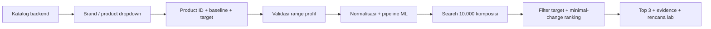

# Product-aware AI Reformulation: implementasi dan batas prototype

Status: implementasi lokal; belum push/deploy. Model baru dilatih lokal CPU,
bukan Cloudeka. Formula Rescue tidak diretrain atau diganti.

## 1. Perubahan yang digunakan aplikasi

Choose Brand -> Choose Product -> Category otomatis. Formula version dihapus.
Frontend mengambil katalog melalui GET /api/ai-reformulation/products; Next.js
meneruskannya ke GET /ai-reformulation/products pada backend gabungan.
Tidak ada daftar produk atau respons kandidat hard-coded sebagai fallback UI.

Brand bukan input numerik atau fitur terpisah; product_id mengidentifikasi produk
dan brand-nya, sedangkan category_id diturunkan backend dari katalog terpercaya.
Mengganti produk mengganti baseline, identitas/range faktor, serta menghapus hasil
lama dan konfirmasi target agar tidak salah diasosiasikan dengan produk baru.

## 2. Katalog dan data dummy

22 profil, 11 kategori, 6 brand: Wardah, Emina, Kahf, Putri, Biodef, Make Over.
Nama produk adalah identitas publik; pemakaian nama tidak menyatakan afiliasi,
endorsement, akses formulasi internal, atau bukti kinerja produk tersebut.

Semua baseline, kelompok faktor, batas kadar dan respons merupakan data buatan tim:
SYNTHETIC_PROTOTYPE_DATA, is_empirical_ground_truth=false.
Ini bukan dataset Mercurio yang diperluas dan bukan formula asli Paragon.
Model lama Mercurio dan laporan hasilnya tetap disimpan terpisah.

| Category | Tiga peran faktor sintetis |
|---|---|
| Moisturizing Cream | Humectant, emollient, structurant |
| Gel Moisturizer | Humectant, light emollient, gel structurant |
| Facial Cleanser | Primary surfactant, secondary surfactant, conditioning humectant |
| Face Serum | Functional active, humectant, solubilizer/structurant |
| Face Toner | Humectant, functional active, solubilizer |
| Sunscreen | UV filter system, emollient, structurant/dispersant |
| Micellar Water | Micellar surfactant, humectant, oil/solubilizer |
| Shampoo | Primary surfactant, conditioning system, rheology modifier |
| Body Wash | Primary surfactant, secondary surfactant, humectant |
| Foundation | Pigment/powder, emollient, structurant/film former |
| Lip Cream | Pigment, emollient, film former/structurant |

Katalog lengkap dan nilai persen: ml/artifacts/synthetic_product_polynomial_ridge_v1/product_catalog.json.
Source profil: ml/product_profiles.py. Source generator/training:
ml/train_product_reformulation.py.

Per produk dibuat 96 baris: 95 kombinasi rasio acak dalam 0.04–0.96 plus baseline
produk. RNG seed 20260918; total 2,112 baris. Persen = rasio × maksimum profil.
Target dihitung dari persamaan polynomial ilustratif yang tertulis dalam
response_equations(), lalu ditambah noise Gaussian kecil:
SD hydration=0.006, stickiness=0.025, oiliness=0.025, consistency=65.
Baseline tidak diberi noise. Noise ini hanya untuk simulasi, bukan variabilitas
yang diukur dalam laboratorium.

Generator menggunakan efek faktor polynomial yang sama dan offset kategori/produk.
Karena itu model ini menunjukkan alur produk-spesifik, **bukan bukti bahwa AI
menguasai kimia semua kategori**. Peran seperti “UV filter system” bukan bahan
INCI tertentu; tidak ada prediksi SPF, brightening, cleansing efficacy, atau safety.

## 3. Preprocessing dan training

1. Backend memvalidasi product_id, tepat tiga angka finite dan kadar dalam range.
2. Category diturunkan dari katalog; persen dibagi maksimum faktor produk.
3. Urutan model: product_id, category_id, factor_a_ratio, factor_b_ratio,
   factor_c_ratio. Tidak ada imputation; teks insight/process bukan fitur model.
4. Split 80/20 stratified by product sebelum fitting: 1,689 development /
   423 holdout. Semua produk terwakili di kedua partisi; komposisi unik per profil.
5. Pipeline numeric: PolynomialFeatures degree 2, include_bias=false,
   StandardScaler. Pipeline categorical: OneHotEncoder untuk product/category.
6. Multi-output Ridge alpha=0.05; tidak ada tuning terhadap holdout.
7. Model evaluasi fit development saja. Setelah evaluasi, artifact serving di-fit
   semua 2,112 baris. Metrik bukan inference pada training artifact full-data.

Versions dan SHA256 tercatat dalam model_metadata.json. Loader hanya menerima
artifact buatan tim, memeriksa checksum model/katalog, urutan fitur, dan fixture.
Checksum mendeteksi perubahan tetapi bukan autentikasi jika model+metadata diganti.

## 4. Hasil holdout sintetis

| Output | MAE | RMSE | R² |
|---|---:|---:|---:|
| Hydration ratio | 0.004534 | 0.005666 | 0.999056 |
| Stickiness 0–10 | 0.020224 | 0.025650 | 0.998875 |
| Oiliness 0–10 | 0.020665 | 0.025660 | 0.998928 |
| Consistency index | 53.973484 | 67.718679 | 0.999903 |

MAE/RMSE mengikuti satuan target; consistency adalah indeks sintetis arbitrer,
bukan viscosity cP. R² bukan classification accuracy atau peluang berhasil di lab.
Holdout ini hanya menguji interpolasi generator yang sudah ditentukan sendiri,
bukan produk baru, data brand nyata atau generalisasi laboratorium.
Mean-regressor baseline, holdout predictions, split manifest, dan dataset tersimpan
dalam folder artifact; tidak ada data empiris yang diam-diam dicampur.

## 5. Mengapa hasil dropdown berbeda

product_id dan category_id masuk model sebagai one-hot features. Produk memiliki
offset target yang berbeda saat training. Selain itu baseline/range setiap profil
berbeda. Jadi optimizer memakai profil terpilih dan memprediksi kombinasi yang
berbeda; UI tidak memilih dari daftar hasil canned.

Alur:

Optimizer terpisah dari training: Latin hypercube search di range profil,
fixed factors tidak berubah, baseline tidak dikembalikan sebagai alternatif.
Ranking perubahan ternormalisasi terkecil, hydration tertinggi, stickiness terendah,
lalu keragaman kandidat. Bisa menghasilkan 0–3 kandidat, bukan menjamin selalu tiga.
Tidak ada training ulang setiap klik. Candidate ID juga menyertakan product_id.

## 6. Apa yang tetap belum tersedia

- Formula komersial lengkap dan mass balance; faktor sintetis bukan recipe siap produksi.
- Prediksi stability/safety/efficacy/process; Formula Rescue tetap khusus shampoo historis.
- Parsing otomatis insight teks: target angka harus dikonfirmasi R&D.
- Penyimpanan lab/session, monthly retraining, upgrade otomatis, rollback model.
- Bukti training Cloudeka, fresh Linux/Vercel runtime dan public deployment terbaru.

Untuk meningkatkan model nyata, kumpulkan resep/ingredient identities dan kadar,
product category yang konsisten, protokol ukur, replicate/batch, serta target lab
terukur. Data sintetis tidak boleh dihitung sebagai evidence lab; model nyata
harus dievaluasi pada batch/produk independen sebelum dipromosikan.

## 7. Verifikasi dan deployment

Backend tests mengecek semua 22 baseline, perubahan prediksi pada komposisi sama
untuk dua product_id, unknown product, range produk dan Top 3 Rescue lama.
Frontend tests mengecek binding/catalog, target mapping, stale-result invalidation,
dan tidak menerima respons untuk produk yang salah.
Browser harness membandingkan hasil proses Wardah dan Emina, mobile/error/empty states.
Hasil verifikasi lokal pada 18 September 2026:

| Pemeriksaan | Hasil |
|---|---|
| Backend API tests | 22/22 PASS |
| ML tests (historis + produk sintetis) | 17/17 PASS |
| Frontend client/proxy tests | 20/20 PASS |
| TypeScript + Next production build | PASS |
| Backend HTTP smoke | 7 endpoint PASS |
| Next production proxy -> FastAPI HTTP | Catalog, prediction, dua produk, Top 3, empty, invalid input PASS |
| Browser Chromium headless nyata | 16 checks PASS, termasuk brand/category, Wardah vs Emina, mobile 390 px, error/retry |

Bug yang ditemukan browser: kadar baseline 1.936% tidak kompatibel dengan input
step=0.01. Input faktor/search bounds kini memakai step=any; full precision tetap
dikirim ke backend. Uji kedua produk diulang dan lolos setelah perbaikan.

Artifact joblib 3.654 byte, katalog 20.135 byte; tidak ada tambahan dependency ML.
Ukuran ini bukan total bundle function Vercel karena library runtime juga dihitung.

Vercel config menyertakan joblib, metadata, fixture dan product_catalog.json baru.
Binding SPONTAN_BACKEND_URL yang sama dipakai kedua engine; tidak perlu public env
baru. Belum ada push/deploy dalam pekerjaan ini; rilis frontend **dan** backend
bersama karena kontrak AI berubah. Backend lama Mercurio tidak kompatibel dengan UI baru.

Predicted / estimated and requires physical laboratory validation.
